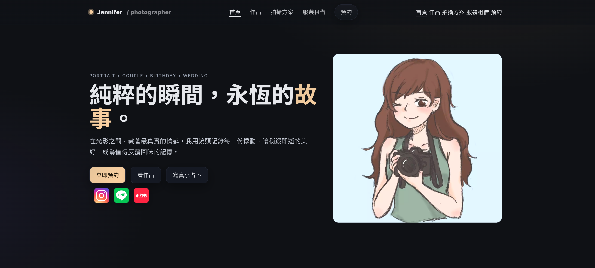
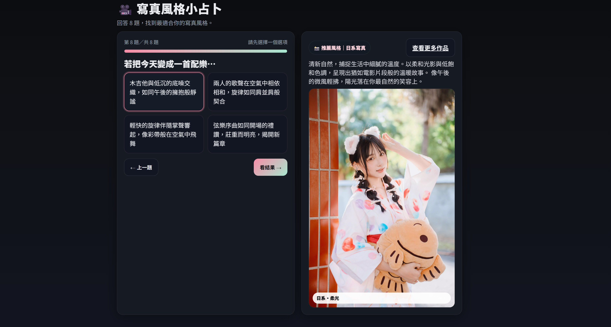

# Jennifer_web

<a href="https://kcc6128.github.io/Jennifer_web/" target="_blank" rel="noopener noreferrer">
Live Demo — View on GitHub Pages
</a>

A responsive **photographer portfolio website** built with HTML, CSS, and JavaScript.  
使用 **HTML / CSS / JavaScript** 製作的響應式 (RWD) 攝影師個人網站，包含首頁、作品集、服務介紹、租借須知與寫真風格小占卜頁面。

---

## Website Preview

### 首頁（Home）


### 攝影作品集（Works）


### 寫真風格小占卜（Style Quiz）


---

## Pages（網站頁面說明）

| 頁面名稱       | 檔案             | 說明 |
|----------------|------------------|------|
| Home           | `index.html`     | 首頁入口，包含主視覺、簡介與導覽連結。 |
| Works          | `works.html`     | 攝影作品集頁面，展示不同主題的拍攝作品。 |
| Services       | `services.html`  | 拍攝方案與服務內容介紹。 |
| Rental         | `rental.html`    | 租借須知與注意事項說明。 |
| Style Quiz     | `style_quiz.html`| 寫真風格小占卜，透過問卷推薦適合的拍攝風格。 |

---

## Features

### 響應式設計（RWD）
- 使用 Flex / Grid 配合 media query
- 支援手機、平板、桌面瀏覽
- 版面會依螢幕寬度自動調整

### 攝影作品集
- 作品依主題分類（如日系、人像、情侶等）
- 卡片 / 格狀展示
- 滑鼠 hover 效果強化視覺體驗

### 服務與租借頁面
- 條列式說明拍攝方案、規範與流程
- 讓訪客能快速了解內容與價格

### 寫真風格小占卜（Style Quiz）
- 使用原生 JavaScript 製作互動問卷
- 根據使用者回答計算風格分數
- 自動推薦適合的寫真類型

---

## Tech Stack

- **HTML5**：結構與內容
- **CSS3**：版面設計、RWD、動畫
- **JavaScript (Vanilla JS)**：互動效果與小占卜功能
- **Google Fonts**：網站字型

---

## Project Structure

```
Jennifer_web/
│
├─ img/                           # 所有圖片依主題分類
│   ├─ self/                      # 個人照片、首頁照片
│   ├─ works/                     # 作品集圖片
│   └─ rental/                    # 租借服裝圖片
│
├─ index.html                     # 首頁
├─ works.html                     # 攝影作品集頁面
├─ services.html                  # 服務介紹頁面
├─ rental.html                    # 租借須知頁面
├─ style_quiz.html                # 風格占卜 (JavaScript)
│
└── README.md                     # 說明文件
```


